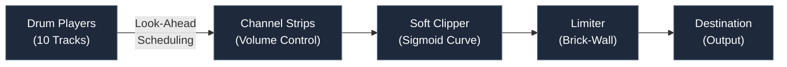

# TR-08 | High-Performance Web Drum Machine

A sample-accurate, real-time 808-style sequencer engineered for low-latency browser performance.

## Engineering Highlights

**Sample-Accurate Timing**: Architected a look-ahead scheduling system using the Web Audio API hardware clock (via Tone.js) to eliminate JavaScript event loop jitter.

**Low-Latency UI**: Optimized the critical rendering path to achieve an INP (Interaction to Next Paint) of 59ms, providing instantaneous visual feedback for live performance.

**Signal Processing Chain**: Implemented a custom master bus including sigmoid-curve soft-clip saturation and brick-wall limiting to maintain professional loudness standards.

**Fault-Tolerant Asset Loading**: Engineered a multi-tier timeout architecture using Promise.allSettled to ensure application stability across disparate network conditions.

## Tech Stack

- **Frontend**: React 19, TypeScript 5.9, Tailwind CSS v4, Vite
- **Audio Engine**: Tone.js (Web Audio API), custom angle-to-dB conversion
- **State & Persistence**: Supabase (PostgreSQL), Zod, Drizzle ORM
- **DevOps**: GitHub Actions CI/CD, Vercel Deployment

## System Architecture

### Audio Signal Flow

Real-time constraints are managed by decoupling audio scheduling from UI rendering. The sequencer schedules events in a look-ahead buffer, allowing the Web Audio API to handle precise timing of sample triggers independent of React's render cycles.

### Volume Control System

The rotational knob uses **angle-to-dB conversion**:

- Input range: 10–256 degrees
- Output range: -25 dB to +5 dB
- Linear interpolation: `((angle - min) / (max - min)) * (dbMax - dbMin) + dbMin`

### Beat Sequencing

- **16-step grid** with 10 instrument tracks (2 kicks, 2 bass synths, 2 snares, 2 synth stabs, 2 hi-hats)
- **Transport-precise timing** via Tone.js at 16th note intervals
- **Real-time BPM adjustment** (40–300 range)
- **Custom beat naming** with title editor

## Performance Benchmarks

| Metric                          | Value  |
| ------------------------------- | ------ |
| Lighthouse Performance          | 99/100 |
| Total Blocking Time (TBT)       | <50ms  |
| Interaction to Next Paint (INP) | 59ms   |
| Time to Interactive (TTI)       | <1.5s  |

## Key Modules

- **src/lib/audioEngine.ts**: Hardware clock integration and effects chain
- **src/lib/beatUtils.ts**: Schema normalization and persistence
- **src/components/Knob.tsx**: High-precision rotational math
- **src/sequencer.ts**: Tone.js Transport engine with look-ahead scheduling
- **src/components/Pad.tsx**: Grid step buttons with playhead tracking
