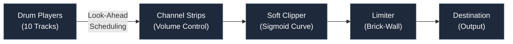

# TR-08 | High-Performance Web Drum Machine

A sample-accurate, real-time 808-style sequencer engineered for low-latency browser performance.

## Demo

[Watch the demo on Vimeo](https://vimeo.com/1157277906)

## Engineering Highlights

**Sample-Accurate Timing**: Architected a look-ahead scheduling system using the Web Audio API hardware clock (via Tone.js) to eliminate JavaScript event loop jitter.

**Low-Latency UI**: Optimized the critical rendering path to achieve an INP (Interaction to Next Paint) of 59ms, providing instantaneous visual feedback for live performance.

**Signal Processing Chain**: Implemented a custom master bus including sigmoid-curve soft-clip saturation and brick-wall limiting to maintain professional loudness standards.

**Fault-Tolerant Asset Loading**: Engineered a multi-tier timeout architecture using Promise.allSettled to ensure application stability across disparate network conditions.

## Tech Stack

- **Frontend & UI:** React 19, TypeScript 5.9, Tailwind CSS v4, Vite.
- **Audio & Systems:** Web Audio API (Tone.js), Logarithmic Signal Mapping, Master Bus Dynamics Processing.
- **Backend & Persistence:** Supabase (PostgreSQL), Drizzle ORM, Zod-backed Schema Evolution.
- **Security & DevOps:** PostgreSQL Row-Level Security (RLS), GitHub Actions CI/CD, Vercel.

## System Architecture

### Audio Signal Flow

Real-time constraints are managed by decoupling audio scheduling from UI rendering. The sequencer schedules events in a look-ahead buffer, allowing the Web Audio API to handle precise timing of sample triggers independent of React's render cycles.

### Modular Rotational Control System

Refactored the knob component into a **parameter-agnostic rotational interface**:

- **Input**: Rotation angle (10–256 degrees)
- **Output**: Normalized value (arbitrary range, determined by parent)
- **Mapping**: Linear interpolation agnostic to parameter type

This decoupling enables the same component to control volume (−25 to +5 dB), pitch, swing, overdrive, or any continuous parameter. The knob handles only angle-to-value conversion; the parent component defines the output semantics.

### Beat Sequencing

- **16-step grid** with 10 instrument tracks (2 kicks, 2 bass synths, 2 snares, 2 synth stabs, 2 hi-hats)
- **Transport-precise timing** via Tone.js at 16th note intervals
- **Real-time BPM adjustment** (40–300 range)
- **Custom beat naming** with title editor

## Performance Benchmarks

| Metric                          | Value  |
| ------------------------------- | ------ |
| Lighthouse Performance          | 99/100 |
| Total Blocking Time (TBT)       | <50ms  |
| Interaction to Next Paint (INP) | 59ms   |
| Time to Interactive (TTI)       | <1.5s  |

## Key Modules

- **src/lib/audioEngine.ts**: Orchestrates the Web Audio graph, including dynamic signal routing, master effects chain initialization, and fault-tolerant asset loading.
- **src/sequencer.ts**: The core timing engine; abstracts Tone.js Transport to provide decoupled audio scheduling from the React render cycle.
- **src/lib/beatUtils.ts**: Manages data integrity and schema evolution; implements bidirectional transformation between UI state and Zod-validated persistence models.
- **src/components/Knob.tsx**: A parameter-agnostic rotational input handler with configurable value-mapping.
- **src/components/Pad.tsx**: A performance-optimized step-sequencer interface featuring conditional rendering logic for real-time playhead tracking and ghost-note states.
